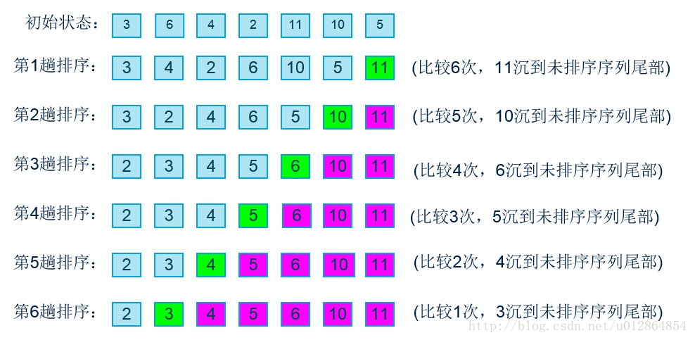
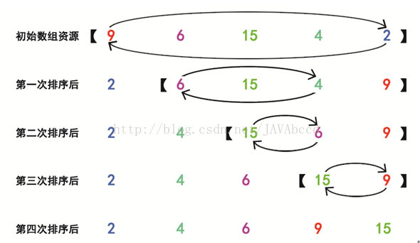
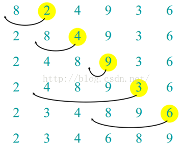

# 七大排序算法的实现 C++#
## 1.冒泡排序 ##

[**冒泡排序代码**](CPP/bubblesort.cpp)

原理：

1、比较相邻的元素。如果第一个比第二个大（小），就交换他们两个。
	  
2、对每一对相邻元素作同样的工作，从开始第一对到结尾的最后一对。这步做完后，最后的元素会是最大（小）的数。

3、针对所有的元素重复以上的步骤，除了最后已经选出的元素（有序）。

4、持续每次对越来越少的元素（无序元素）重复上面的步骤，直到没有任何一对数字需要比较，则序列最终有序。

> 步骤可视化如下图

* C++代码实现
    
		void bubbleSort(int arr[], int n)
		{
	    	int i;
	    	int temp;
	    	for(i = 0;i<n-1;i++)
	    	{
	        	if(arr[i]>arr[i+1])
	        	{
		            temp = arr[i];
		            arr[i] = arr[i+1];
		            arr[i+1] = temp;
	        	}
	    	}
		}
		void bubbleResult(int arr[],int n)
		{
		    for(int i = n;i>=1;i--)
		    {
		        bubbleSort(arr,n);
		    }
		}

## 2.选择排序 ##
[**选择排序代码**](CPP/selectionsort.cpp)

原理：

1.选择排序也是一种简单直观的排序算法。它的工作原理很容易理解：初始时在序列中找到最小（大）元素，放到序列的起始位置作为已排序序列；然后，再从剩余未排序元素中继续寻找最小（大）元素，放到已排序序列的末尾。以此类推，直到所有元素均排序完毕。

2.注意选择排序与冒泡排序的区别：冒泡排序通过依次交换相邻两个顺序不合法的元素位置，从而将当前最小（大）元素放到合适的位置；而选择排序每遍历一次都记住了当前最小（大）元素的位置，最后仅需一次交换操作即可将其放到合适的位置。

> 步骤可视化如下图
> 
 

* C++代码实现
* 
		int findMaxPos(int arr[],int n)
		{
		    int i;
		    int pos = 0;
		    int max = arr[0];
		    for(i = 1;i<n;i++)
		    {
		        if(arr[i]>max)
		        {
		            max = arr[i];
		            pos = i;
		        }
		    }
		    return pos;
		
		}
		void selectionSort(int arr[],int n)
		{
		    int temp;
		    for(int i = n;i>1;i--)
		    {
		        int pos = findMaxPos(arr,i);
		        temp = arr[pos];
		        arr[pos] = arr[i-1];
		        arr[i-1] = temp;
		    }
		}

## 3.插入排序 ##
[**插入排序代码**](CPP/insertsort.cpp)

原理：

插入排序算法有种递归的思想在里面，它由N-1趟排序组成。初始时，只考虑数组下标0处的元素，只有一个元素，显然是有序的。

然后第一趟 对下标 1 处的元素进行排序，保证数组[0,1]上的元素有序；

第二趟 对下标 2 处的元素进行排序，保证数组[0,2]上的元素有序；

.....

.....

第N-1趟对下标 N-1 处的元素进行排序，保证数组[0,N-1]上的元素有序，也就是整个数组有序了。

它的递归思想就体现在：当对位置 i 处的元素进行排序时，[0,i-1]上的元素一定是已经有序的了。
> 步骤可视化如下图
> 

* C++代码实现
* 
		void insert(int arr[],int k)
		{
		    int key = arr[k];
		    int i = k;
		    while(key < arr[i-1])
		    {
		        arr[i] = arr[i-1];
		        i--;
		        if(i == 0)
		        {
		            break;
		        }
		    }
		    arr[i] = key;
		}
		void insertSort(int arr[],int n)
		{
		    int i;
		    for(i = 1;i<n;i++)
		    {
		        insert(arr,i);
		    }
		}

## 4.归并排序 ##
[**归并排序代码**](CPP/mergesort.cpp)

原理：

归并排序（MERGE-SORT）是利用归并的思想实现的排序方法，该算法采用经典的分治（divide-and-conquer）策略（分治法将问题分(divide)成一些小的问题然后递归求解，而治(conquer)的阶段则将分的阶段得到的各答案"修补"在一起，即分而治之)。

> 步骤可视化如下图
> 
> 分而治之
> 

> 合并相邻有序子序列

再来看看治阶段，我们需要将两个已经有序的子序列合并成一个有序序列，比如上图中的最后一次合并，要将[4,5,7,8]和[1,2,3,6]两个已经有序的子序列，合并为最终序列[1,2,3,4,5,6,7,8]，来看下实现步骤。
> 

* C++代码实现
* 
		void merge(int *data,int start,int end,int *result)
		{
		    int left_length = (end - start + 1) / 2 + 1;//左部分区间的数据元素的个数
		    int left_index = start;
		    int right_index = start + left_length;
		    int result_index = start;
		    while(left_index < start + left_length && right_index < end+1)
		    {
		        //对分别已经排好序的左区间和右区间进行合并
		        if(data[left_index] <= data[right_index])
		            result[result_index++] = data[left_index++];
		        else
		            result[result_index++] = data[right_index++];
		    }
		    while(left_index < start + left_length)
		        result[result_index++] = data[left_index++];
		    while(right_index < end+1)
		        result[result_index++] = data[right_index++];
		}
		void merge_sort(int *data, int start, int end, int *result)
		{
		    if(1 == end - start)//如果区间中只有两个元素，则对这两个元素进行排序
		    {
		        if(data[start] > data[end])
		        {
		            int temp  = data[start];
		            data[start] = data[end];
		            data[end] = temp;
		        }
		        return;
		    }
		    else if(0 == end - start)//如果只有一个元素，则不用排序
		        return;
		    else
		    {
		        //继续划分子区间，分别对左右子区间进行排序
		        merge_sort(data,start,(end-start+1)/2+start,result);
		        merge_sort(data,(end-start+1)/2+start+1,end,result);
		        //开始归并已经排好序的start到end之间的数据
		        merge(data,start,end,result);
		        //把排序后的区间数据复制到原始数据中去
		        for(int i = start;i <= end;++i)
		            data[i] = result[i];
		    }
		}

## 5.希尔排序 ##
[**希尔排序代码**](CPP/shellsort.cpp)

原理：

希尔排序是希尔（Donald Shell）于1959年提出的一种排序算法。希尔排序也是一种插入排序，它是简单插入排序经过改进之后的一个更高效的版本，也称为缩小增量排序，同时该算法是冲破O(n2）的第一批算法之一。本文会以图解的方式详细介绍希尔排序的基本思想及其代码实现。

希尔排序是把记录按下标的一定增量分组，对每组使用直接插入排序算法排序；随着增量逐渐减少，每组包含的关键词越来越多，当增量减至1时，整个文件恰被分成一组，算法便终止。

　　简单插入排序很循规蹈矩，不管数组分布是怎么样的，依然一步一步的对元素进行比较，移动，插入，比如[5,4,3,2,1,0]这种倒序序列，数组末端的0要回到首位置很是费劲，比较和移动元素均需n-1次。而希尔排序在数组中采用跳跃式分组的策略，通过某个增量将数组元素划分为若干组，然后分组进行插入排序，随后逐步缩小增量，继续按组进行插入排序操作，直至增量为1。希尔排序通过这种策略使得整个数组在初始阶段达到从宏观上看基本有序，小的基本在前，大的基本在后。然后缩小增量，到增量为1时，其实多数情况下只需微调即可，不会涉及过多的数据移动。

　　我们来看下希尔排序的基本步骤，在此我们选择增量gap=length/2，缩小增量继续以gap = gap/2的方式，这种增量选择我们可以用一个序列来表示，{n/2,(n/2)/2...1}，称为增量序列。希尔排序的增量序列的选择与证明是个数学难题，我们选择的这个增量序列是比较常用的，也是希尔建议的增量，称为希尔增量，但其实这个增量序列不是最优的。此处我们做示例使用希尔增量。

> 步骤可视化如下图
> 

* C++代码实现
* 
		void shell_sort(int arr[],int len){
		    int step = len / 2;      //初始增量
		    while(step > 0){
		        //无序部分
		        for(int i = step; i < len; i++){
		            int temp = arr[i];
		            int j;
		            //子序列中的插入排序,这是有序部分
		            for(j = i-step; j>=0 && temp < arr[j]; j=j-step)
		                //在找到当前元素合适位置前，元素后移
		                arr[j+step]=arr[j];
		            arr[j+step]=temp;
		        }
		        step /= 2;
		    }
		}

## 6.堆排序 ##
[**堆排序代码**](CPP/heapsort.cpp)

原理：

堆排序是利用堆这种数据结构而设计的一种排序算法，堆排序是一种选择排序，它的最坏，最好，平均时间复杂度均为O(nlogn)，它也是不稳定排序。首先简单了解下堆结构。

堆是具有以下性质的完全二叉树：每个结点的值都大于或等于其左右孩子结点的值，称为大顶堆；或者每个结点的值都小于或等于其左右孩子结点的值，称为小顶堆。如下图：

同时，我们对堆中的结点按层进行编号，将这种逻辑结构映射到数组中就是下面这个样子

该数组从逻辑上讲就是一个堆结构，我们用简单的公式来描述一下堆的定义就是：

大顶堆：arr[i] >= arr[2i+1] && arr[i] >= arr[2i+2]  

小顶堆：arr[i] <= arr[2i+1] && arr[i] <= arr[2i+2]  

ok，了解了这些定义。接下来，我们来看看堆排序的基本思想及基本步骤：

堆排序的基本思想是：将待排序序列构造成一个大顶堆，此时，整个序列的最大值就是堆顶的根节点。将其与末尾元素进行交换，此时末尾就为最大值。然后将剩余n-1个元素重新构造成一个堆，这样会得到n个元素的次小值。如此反复执行，便能得到一个有序序列了

###步骤一 构造初始堆。将给定无序序列构造成一个大顶堆（一般升序采用大顶堆，降序采用小顶堆)。

　a.假设给定无序序列结构如下

  b.此时我们从最后一个非叶子结点开始（叶结点自然不用调整，第一个非叶子结点 arr.length/2-1=5/2-1=1，也就是下面的6结点），从左至右，从下至上进行调整。

  c.找到第二个非叶节点4，由于[4,9,8]中9元素最大，4和9交换。

  d.这时，交换导致了子根[4,5,6]结构混乱，继续调整，[4,5,6]中6最大，交换4和6。

**此时，我们就将一个无需序列构造成了一个大顶堆。**

###步骤二 将堆顶元素与末尾元素进行交换，使末尾元素最大。然后继续调整堆，再将堆顶元素与末尾元素交换，得到第二大元素。如此反复进行交换、重建、交换。

  a.将堆顶元素9和末尾元素4进行交换

  b.重新调整结构，使其继续满足堆定义

  c.再将堆顶元素8与末尾元素5进行交换，得到第二大元素8.

  d.后续过程，继续进行调整，交换，如此反复进行，最终使得整个序列有序

**再简单总结下堆排序的基本思路：**

　　**a.将无需序列构建成一个堆，根据升序降序需求选择大顶堆或小顶堆;**

　　**b.将堆顶元素与末尾元素交换，将最大元素"沉"到数组末端;**

　　**c.重新调整结构，使其满足堆定义，然后继续交换堆顶元素与当前末尾元素，反复执行调整+交换步骤，直到整个序列有序。**

* C++代码实现
* 
		void heap(int arr[],int len,int index)
		{
		    int left = 2*index +1;
		    int right = 2*index +2;
		    int maxId = index;
		    if(left<len && arr[left]>arr[maxId])
		    {
		        maxId = left;
		    }
		    if(right<len && arr[right]>arr[maxId])
		    {
		        maxId = right;
		    }
		    if(maxId != index)
		    {
		        int temp = arr[maxId];
		        arr[maxId] = arr[index];
		        arr[index] = temp;
		//        swap(arr[maxId], arr[index]);
		        heap(arr,len,maxId);
		    }
		}
		void heap_sort(int arr[],int len)
		{
		    for(int i=len/2 - 1; i >= 0; i--)  // 对每一个非叶结点进行堆调整(从最后一个非叶结点开始)
		        {
		            heap(arr, len, i);
		        }
		    for(int i = len - 1; i >= 1; i--)
		    {
		//        swap(arr[0], arr[i]);           // 将当前最大的放置到数组末尾
		        int temp = arr[0];
		        arr[0] = arr[i];
		        arr[i] = temp;
		        heap(arr, i, 0);              // 将未完成排序的部分继续进行堆排序
		    }
		}

## 7.快速排序 ##
[**快速排序代码**](CPP/quicksort.cpp)

原理：

快速排序由C. A. R. Hoare在1962年提出。它的基本思想是：通过一趟排序将要排序的数据分割成独立的两部分，其中一部分的所有数据都比另外一部分的所有数据都要小，然后再按此方法对这两部分数据分别进行快速排序，整个排序过程可以递归进行，以此达到整个数据变成有序序列

**三数取中**

　　在快排的过程中，每一次我们要取一个元素作为枢纽值，以这个数字来将序列划分为两部分。在此我们采用三数取中法，也就是取左端、中间、右端三个数，然后进行排序，将中间数作为枢纽值。

**根据枢纽值进行分割**

* C++代码实现
* 
		void algorithm_me::dealPivot(int arr[], int left, int right)
		{
		        int mid = (left + right) / 2;
		        if (arr[left] > arr[mid])
		        {
		            swap(arr[left], arr[mid]);
		        }
		        if (arr[left] > arr[right])
		        {
		            swap(arr[left], arr[right]);
		        }
		        if (arr[right] < arr[mid])
		        {
		            swap(arr[right], arr[mid]);
		        }
		        swap(arr[right - 1], arr[mid]);
		
		}
		void algorithm_me::quicksort(int arr[],int L,int R)
		{
		    dealPivot(arr,L,R);
		    int i = L;
		    int j = R;
		//    int pivot = arr[(L+R)/2];
		    int pivot = arr[R-1];
		    while(i<=j)
		    {
		        while(arr[i]<pivot)
		        {
		            i++;
		        }
		        while(arr[j]>pivot)
		        {
		            j--;
		        }
		        if(i<=j)
		        {
		            int temp = arr[i];
		            arr[i] = arr[j];
		            arr[j] = temp;
		            i++;
		            j--;
		        }
		    }
		    if(L<j)
		    {
		        quicksort(arr,L,j);
		    }
		    if(i<R)
		    {
		        quicksort(arr,i,R);
		    }
		}

